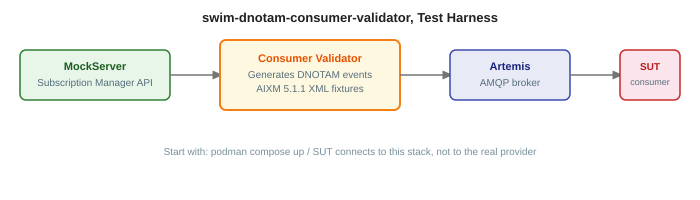
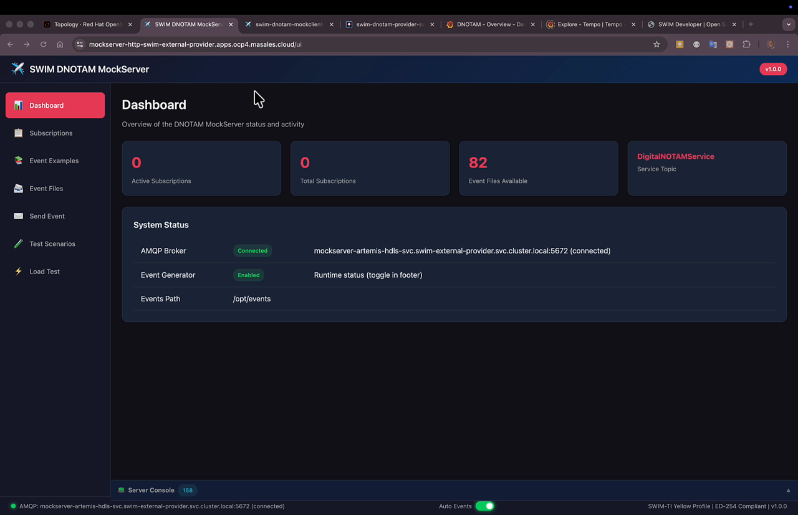

# swim-dnotam-consumer-validator

Simulates the EUROCONTROL EAD (European AIS Database) for testing DNOTAM Consumer implementations. It provides a Subscription Manager REST API, publishes AIXM 5.1.1 events via AMQP, and generates periodic heartbeats, everything a Consumer expects from a real provider, without requiring access to production EUROCONTROL infrastructure.



## What it does

- **Subscription Manager API**, SPEC-170 compliant REST endpoints for subscription lifecycle
- **AMQP event publishing**, sends AIXM events to subscriber queues via ActiveMQ Artemis
- **Configurable event generation**, cron-based injection with date and location randomization
- **82 sample AIXM events**, validated examples covering 10 scenario types
- **Heartbeat publishing**, periodic heartbeats to subscription heartbeat queues
- **Fault injection**, runtime chaos testing (HTTP errors, delays, request drops)

---

## GET STARTED

### Prerequisites

- Java 21
- Maven 3.9+
- Podman (or any OCI-compatible runtime with Compose support)
- Shared modules installed in local Maven repo (see below)

### 0. Install shared modules

This project depends on shared modules from [swim-developer-validators](https://github.com/swim-developer/swim-developer-validators). They must be installed in your local Maven repository before building or running this project.

Clone and install once:

```bash
git clone git@github.com:swim-developer/swim-developer-validators.git
cd swim-developer-validators
./mvnw clean install -DskipTests
```

You only need to repeat this step when `swim-developer-validators` is updated.

### 1. Start the infrastructure

```bash
podman compose up -d
```

Services started:

| Service | Port | Description |
|---------|------|-------------|
| `dnotam-consumer-validator-artemis` | 5673 (TLS), 5674, 8163 | AMQP broker for event delivery |
| `dnotam-consumer-validator-mariadb` | 3307 | Validator persistence |

### 2. Run the validator

```bash
./mvnw quarkus:dev
```

- Subscription Manager API: http://localhost:8084
- Swagger UI: http://localhost:8084/swagger-ui
- Artemis console: http://localhost:8163 (admin / admin)

### 3. Point your consumer at it

Configure `swim-dnotam-consumer` to use this validator as its provider:

```properties
# application-dev.properties
swim.providers=[{
  "providerId":"validator",
  "subscriptionManager":{"url":"http://localhost:8084"},
  "amqpBroker":{"host":"localhost","port":5674,"sslEnabled":false,"username":"admin","password":"admin"}
}]
```

Events will start arriving at the consumer immediately after subscriptions are created.

### Verify, happy path

```bash
# Validator health
curl -s http://localhost:8084/q/health | jq .status

# List topics (should return DNOTAM/v1)
curl -s http://localhost:8084/swim/v1/topics | jq .

# Create a subscription (validator returns it as PAUSED)
SUBID=$(curl -s -X POST http://localhost:8084/swim/v1/subscriptions \
  -H "Content-Type: application/json" \
  -d '{"topicName":"DNOTAM/v1","subscriberId":"test-01"}' | jq -r .id)

# Activate it
curl -s -X PUT "http://localhost:8084/swim/v1/subscriptions/${SUBID}" \
  -H "Content-Type: application/json" \
  -d '{"status":"ACTIVE"}' | jq .
```

After activation, the Artemis queue for the subscription starts receiving AIXM events (visible in the Artemis console at http://localhost:8163).

---

## Sample event scenarios

| Scenario | Code | Count |
|----------|------|-------|
| Runway Closure | `RWY.CLS` | 2 |
| Aerodrome Closure | `AD.CLS` | 3 |
| Taxiway Closure | `TWY.CLS` |: |
| Apron Closure | `APN.CLS` | 2 |
| Runway Limitation | `RWY.LIM` | 2 |
| Aerodrome Limitation | `AD.LIM` | 3 |
| Surface Condition | `SFC.CON` | 6 |
| Airspace Activation | `SAA.ACT` | 3 |
| Airspace New | `SAA.NEW` | 3 |
| Obstacle New | `OBS.NEW` | 2 |
| Navaid Unserviceable | `NAV.UNS` | 2 |
| Stand Limitation | `STAND.LIM` | 1 |
| Runway Change Point | `RCP.CHG` | 1 |

---

## API

| Method | Endpoint | Description |
|--------|----------|-------------|
| `POST` | `/swim/v1/subscriptions` | Create subscription (returns PAUSED) |
| `GET` | `/swim/v1/subscriptions` | List subscriptions |
| `GET` | `/swim/v1/subscriptions/{id}` | Get subscription details |
| `PUT` | `/swim/v1/subscriptions/{id}` | Update status (ACTIVE/PAUSED) |
| `DELETE` | `/swim/v1/subscriptions/{id}` | Delete subscription |
| `GET` | `/swim/v1/topics` | List available topics |
| `GET` | `/swim/v1/topics/{id}` | Get topic details |

---

## Environment variables

| Variable | Default | Description |
|----------|---------|-------------|
| `EVENT_GENERATOR_ENABLED` | `true` | Enable automatic event generation |
| `EVENT_GENERATOR_SCHEDULE` | `0 */1 * * * ?` | Cron expression (default: every minute) |
| `EVENT_GENERATOR_EVENTS_PATH` | `/opt/events` | Path to AIXM event XML files |
| `AMQP_BROKER_HOST` | `mockserver-artemis-hdls-svc` | Artemis broker hostname |
| `AMQP_BROKER_PORT` | `5672` | AMQP 1.0 port |
| `AMQP_BROKER_USERNAME` | `admin` | Authentication username |
| `AMQP_BROKER_PASSWORD` | `admin` | Authentication password |
| `HEARTBEAT_PUBLISHER_ENABLED` | `true` | Enable heartbeat publishing |
| `HEARTBEAT_PUBLISHER_INTERVAL` | `15s` | Heartbeat publishing interval |
| `QUARKUS_HTTP_SSL_CERTIFICATE_FILES` | `/certs/server/tls.crt` | Server certificate |
| `QUARKUS_HTTP_SSL_CERTIFICATE_KEY_FILES` | `/certs/server/tls.key` | Server private key |
| `QUARKUS_HTTP_SSL_CERTIFICATE_TRUST_STORE_FILE` | `/certs/ca/ca.crt` | CA certificate for client validation |

---

## Container images

```
quay.io/masales/swim-dnotam-consumer-validator:latest
```

---

## Build

From the `swim-developer-validators/` repository root:

```bash
make dnotam-consumer-validator-jvm              # JVM multi-arch, build + push

make dnotam-consumer-validator-native-amd64     # Native amd64, build + push  (run on amd64)
make dnotam-consumer-validator-native-arm64     # Native arm64, build + push  (run on arm64)
make dnotam-consumer-validator-manifest         # Create multi-arch manifest
make dnotam-consumer-validator-push             # Push manifest to registry
```

Override: `make dnotam-consumer-validator-jvm REGISTRY=quay.io/myorg TAG=v1.2.3`

---

## Deployment

Includes a Helm chart under `src/main/helm/` with CRC and production values.

## Video

[](https://youtu.be/wzbMA_M4FRM)

---

## License

Licensed under the [Apache License 2.0](LICENSE).
